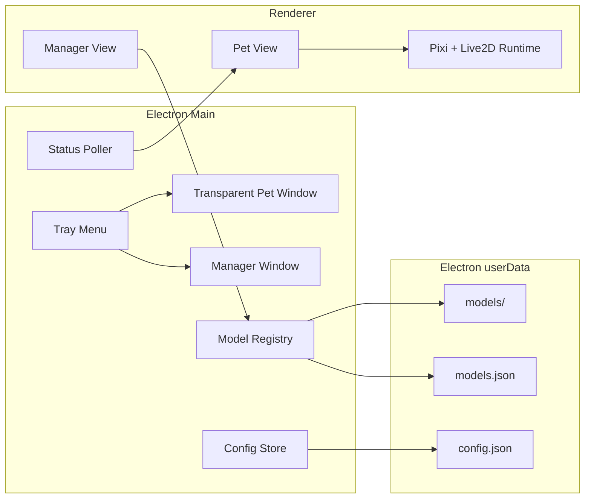

# Architecture



## Main Process

主进程负责所有本地文件和窗口操作：

- 创建透明宠物窗
- 创建管理窗
- 托盘菜单
- IPC handler
- 导入模型目录
- 保存配置
- 轮询本地 AI 状态服务

## Renderer

渲染器只通过 preload 暴露的 API 和主进程通信，不直接读写文件。

## Model Registry

导入模型时：

1. 用户选择一个目录
2. 查找 `.model3.json` 或 `.model.json`
3. 复制整个目录到 `app.getPath("userData")/models/<id>`
4. 写入 `models.json`
5. 管理窗选择模型后写入 `config.json`

## AI Status Adapter

当前只保留 HTTP status poller 骨架。后续把成熟项目中的 Codex JSONL monitor 和 Claude Code hook bridge 重写成 adapter：

- `codex-jsonl`
- `claude-code-hook`
- `http-bridge`

每个 adapter 必须输出统一状态：

```js
{
  source: "codex",
  kind: "thinking | running-tool | replying | complete | idle",
  text: "可展示的回复片段",
  tool: "shell_command",
  updatedAt: "ISO time"
}
```
